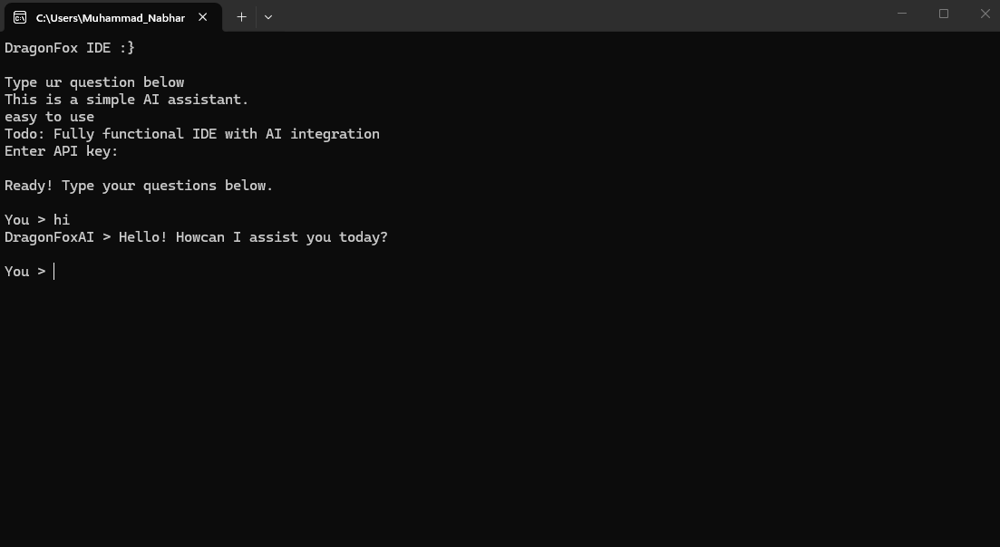

# DragonFox IDE

DragonFox IDE is a lightweight VS Code-inspired desktop editor built with Rust, egui, and eframe. It combines a file explorer, tabbed code editor, terminal, cargo build/run actions, diagnostics, global search, symbol outline, and an AI assistant in one compact native app.



## Features

- VS Code-like layout with activity bar, explorer, search, outline, AI, settings, editor tabs, bottom panel, and status bar
- Syntax-highlighted code editor for Rust-style code, with tabs and unsaved-change indicators
- Workspace explorer with file filtering, create file/folder, rename, delete, and refresh behavior
- Global search across the open workspace
- Symbol outline for Rust, Python, JavaScript, and TypeScript files
- Go To Definition from `F12`, the toolbar, the command palette, the editor context menu, or the Outline panel
- Prefix-matched Rust autocomplete for keywords, macros, standard types, snippets, and local outline symbols
- Lightweight Rust hover information for common language items such as `Vec`, `String`, `Option`, `Result`, and print macros
- Integrated terminal command runner
- Cargo build/run buttons with background execution
- Problems panel populated from cargo warnings and errors
- AI assistant with Ask, Explain, Fix, Refactor, apply-code-block, and copy-code-block actions
- Cursor-style AI context buttons for current file, selected code, terminal output, and project-wide workspace context
- Inline AI editing with Improve Code, Generate Function, and `Ctrl+K`
- Error-aware AI flow with Fix Build Errors from parsed cargo diagnostics
- Source Control panel with Git status, add all, and commit
- Right-click AI code actions for explain, improve, add comments, refactor, and generate tests
- Command palette with `Ctrl+P`, quick save with `Ctrl+S`, and run with `F5`

## Quick Start

```bash
cargo run
```

For an optimized binary:

```bash
cargo build --release
```

## AI Setup

Open Settings inside DragonFox IDE and paste your Hack Club AI proxy API key. The app does not ship with a hard-coded key.

The AI panel sends the active file, selected language, workspace path, and terminal output as context for Explain, Fix, and Refactor actions.

You can also pin extra context with:

- `Add Current File`
- `Add Selected Code`
- `Add Terminal Output`
- `Project-Wide AI`

Inline AI edits can directly replace the active editor buffer, so review the changed tab and save when it looks right.

## Project Layout

| File | Purpose |
| --- | --- |
| `src/main.rs` | App entry point |
| `src/ide.rs` | Desktop IDE UI, workspace actions, terminal, diagnostics, and AI integration |
| `src/highlighter.rs` | Lightweight syntax highlighter |
| `assets/demo.png` | Demo image |

## Requirements

- Rust 1.85+
- A Hack Club AI proxy API key for AI assistant features

## License

[MIT](LICENSE)
